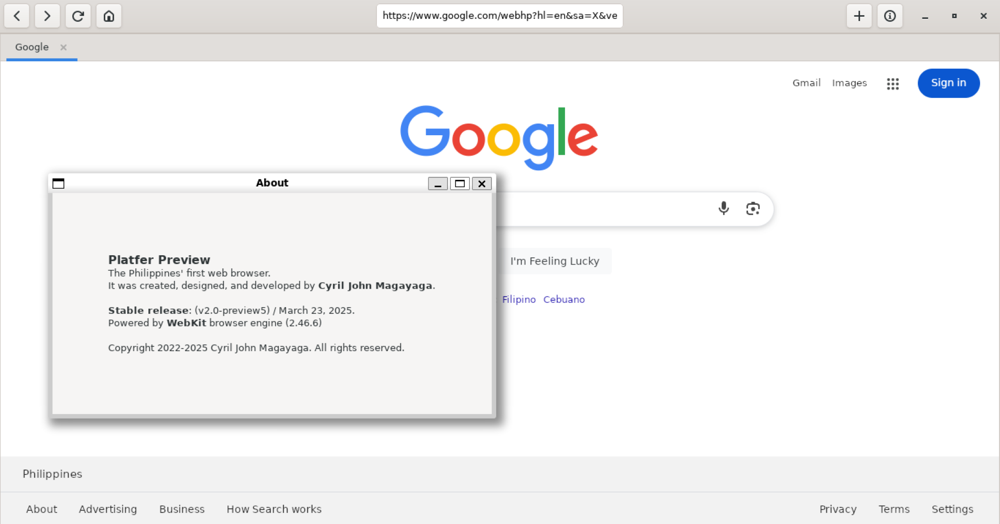

# Platfer Preview
**Platfer Preview** (formerly known as **PlatferPlex**) is a free and open-source web browser created and developed by [**Cyril John Magayaga**](https://github.com/magayaga). It is primarily based on free and open-source software.

It is available for **Linux** operating system and **Windows with WSL** (Windows is not officially supported at this time).

<p align="center">
  <a href="https://github.com/magayaga/PlatferPreview">
    
  </a>
</p>

## History
* December 19, 2022, Cyril John Magayaga announced the new creation of the **Platfer Preview** web browser.
* January 18, 2023, Cyril John Magayaga announced the **Platfer Preview**, upcoming December 2024 on **Linux** operating system like **Python** programming language.
* January 20, 2023, Cyril John Magayaga announced the starting preview development of **Linux** distros and **Windows Subsystem for Linux** including **Ubuntu**.
* January 23, 2023, Cyril John Magayaga announced the successful web browser of **Platfer Preview** for **Linux**, fixing new tabs.
* August 9, 2023, Cyril John Magayaga announced the update code (all def to class Platfer) but forgot to fix multiple and unlimited tabs.
* March 16, 2024, Cyril John Magayaga announced the [Platfer](https://github.com/Platfer) was split into [Platfer Preview](https://github.com/Magayaga/PlatferPreview).
* March 23, 2025, Cyril John Magayaga announced that **unlimited numbers of new tabs** and adding **GLib** had successfully worked.

## Getting Started
Quick start options are available:

```shell
 # Step 1: Clone the repository.
  $ git clone https://github.com/Platfer/Platfer.git
  $ cd Platfer

  # Step 2: Install the Python programming language.
  $ sudo apt-get install python3
  
  # Step 3: Install the GTK, WebKit2, and GLib
  $ sudo apt-get install -y gir1.2-gtk-3.0 webkit2gtk-4.1 gir1.2-glib-2.0
  
  # Step 4: Build and run the application.
  $ python preview/linux/PlatferPreview.py
```

Fix it missing,

```shell
  # Step 1: Clone the repository.
  $ git clone https://github.com/Magayaga/PlatferPreview.git
  $ cd PlatferPreview

  # Step 2: Install the Python programming language.
  $ sudo apt-get install python3
  
  # Step 3: Install the GTK, WebKit2, and GLib
  $ sudo apt-get update --fix-missing
  $ sudo apt-get install -y gir1.2-gtk-3.0
  $ sudo apt-get install webkit2gtk-4.1
  $ sudo apt-get install gir1.2-glib-2.0
  
  # Step 4: Build and run the application.
  $ python3 src/PlatferPreview.py
```

## Copyright
Copyright (c) 2022-2025 Cyril John Magayaga
